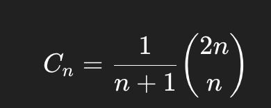

<h2><a href="https://leetcode.com/problems/generate-parentheses/?envType=problem-list-v2&envId=23zq12nv">22. Generate Parentheses</a></h2><h3>Medium</h3><hr><p>Given <code>n</code> pairs of parentheses, write a function to <em>generate all combinations of well-formed parentheses</em>.</p>

<p>&nbsp;</p>
<p><strong class="example">Example 1:</strong></p>
<pre><strong>Input:</strong> n = 3
<strong>Output:</strong> ["((()))","(()())","(())()","()(())","()()()"]
</pre><p><strong class="example">Example 2:</strong></p>
<pre><strong>Input:</strong> n = 1
<strong>Output:</strong> ["()"]
</pre>
<p>&nbsp;</p>
<p><strong>Constraints:</strong></p>

<ul>
	<li><code>1 &lt;= n &lt;= 8</code></li>
</ul>

# 22_General_Parentheses

- back tracking: 가능한 모든 경우를 탐색하되, 안 되는 길은 미리 포기하고 되돌아오는(Backtrack) 탐색 기법
- DFS(모든 선택지를 탐색) 방식 + 조건문으로 빠져나가는 로직이 있다면 back tracking

```jsx
func backtrack(_ state: 상태) {
    // ① 목표 조건에 도달하면 결과 저장
    if 상태가 완성됨 {
        결과.append(현재 상태)
        return
    }

    // ② 가능한 모든 선택지를 탐색
    for 선택 in 가능한_선택들 {
        if 유효하지 않다면 continue
        현재 상태에 선택 추가
        backtrack(새로운 상태)     // 재귀적으로 탐색
        선택 되돌리기 (Backtrack)  // 원상복구
    }
}

```

```swift
import Foundation

class Solution {
    func generateParenthesis(_ n: Int) -> [String] {
        var result: [String] = []

        func solve(_ open: Int, _ close: Int, _ current: String) {
            if current.count == n * 2 {
                result.append(current)
            }

            if open < n {
                solve(open + 1, close, current + "(")
            }
            if close < open {
                solve(open, close + 1, current + ")")
            }
        }
        solve(0,0,"")
        return result
    }
}
```

- backtracking
    - 종료조건:
        - solve: current에 채워진 글자가 원하는 수만큼 채워질경우
- 재귀함수
- 주의사항:
    - “)”의 총 숫자가 “(”보다 작으면 if문을 총 2개 태워서 분기를 태운다
- 참고할만한 내용
    
    Catalan 수 (2n개에서 올바른 괄호를 세는 수)를 나타내는 식으로, **백트래킹 기반 괄호 생성 문제(Generate Parentheses)**의 **시간 복잡도**
    
    
